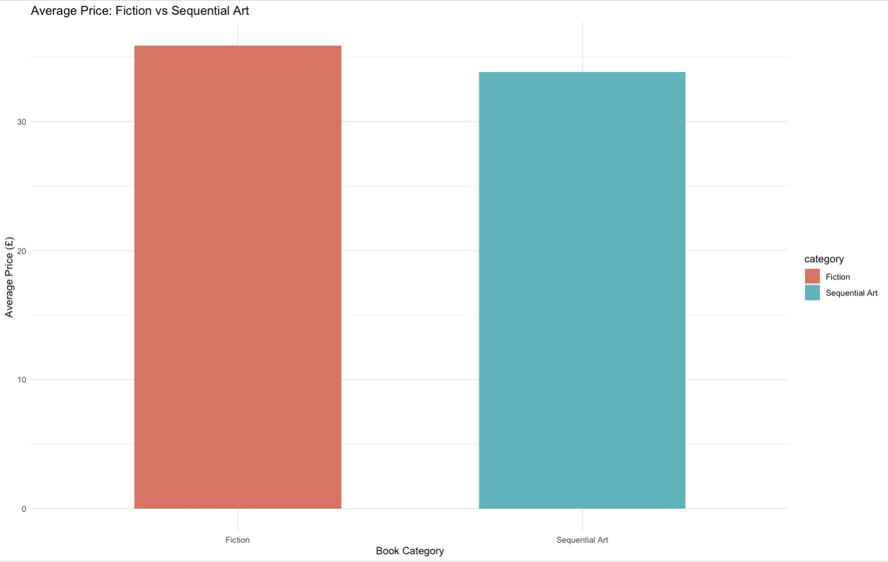

# web-scrapping-for-books---simple-project

# 📚 Books to Scrape: Web Scraping and Exploratory Data Analysis using R


## 📖 Project Overview

This project demonstrates how to perform **web scraping using R** by collecting book information from the **Books to Scrape** website. The scraped data is cleaned, transformed, analyzed, and visualized to compare two book categories:

- Fiction
- Sequential Art

The project illustrates a complete data analytics workflow, from data acquisition to visualization, making it suitable for beginners learning web scraping and exploratory data analysis in R.

---

## 🎯 Objectives

The objectives of this project are to:

- Perform web scraping using the **rvest** package.
- Extract book titles, prices, availability, and ratings.
- Scrape data from the first three pages of each category.
- Clean and organize the collected data.
- Compare book prices and ratings between categories.
- Produce meaningful visualizations for data interpretation.

---

## 🌐 Data Source

Website:

https://books.toscrape.com/

Categories Scraped:

- Fiction
- Sequential Art

Pages Scraped:

- First 3 pages from each category

---

## 🛠 Technologies Used

Programming Language

- R

Libraries

- rvest
- dplyr
- stringr
- ggplot2
- readr

---

## 📂 Project Structure

```
books-to-scrape-r-analysis/
│
├── data/
│   └── books_scraping_dataset.csv
│
├── images/
│   ├── average_price.png
│   ├── price_distribution.png
│   └── rating_distribution.png
│
├── R/
│   └── web_scraping_books.R
│
├── report/
│   └── Project_Report.pdf
│
├── README.md
├── LICENSE
└── .gitignore
```

---

## 🔄 Project Workflow

```
Books to Scrape Website
            │
            ▼
     Web Scraping (rvest)
            │
            ▼
      Data Cleaning
            │
            ▼
 Exploratory Data Analysis
            │
            ▼
 Data Visualization
            │
            ▼
     Business Insights
```

---

## 📊 Data Collected

The following information was extracted for every book:

- Book Title
- Price (£)
- Availability Status
- Star Rating
- Book Category
- Page Number

---

## 📈 Data Analysis

The project computes:

- Total number of books
- Average book price
- Minimum price
- Maximum price
- Average rating
- Rating distribution

---

## 📉 Visualizations

### 1. Average Book Price by Category

This bar chart compares the average price between Fiction and Sequential Art books.

## Average Price




---

### 2. Price Distribution

A boxplot is used to compare the price distribution of both categories.

This visualization helps identify:

- Median price
- Price variability
- Outliers

---

### 3. Rating Distribution

A grouped bar chart illustrates the number of books for each star rating.

The visualization provides an overview of customer ratings across categories.

---

## 📌 Key Findings

- Successfully scraped multiple pages automatically.
- Converted textual ratings into numerical values.
- Combined data from different categories into a single dataset.
- Compared pricing patterns between categories.
- Produced publication-quality visualizations using ggplot2.

---

## ▶️ How to Run

### Step 1

Install the required packages.

```r
install.packages("rvest")
install.packages("dplyr")
install.packages("stringr")
install.packages("ggplot2")
install.packages("readr")
```

### Step 2

Clone the repository.

```
git clone https://github.com/YOUR_USERNAME/books-to-scrape-r-analysis.git
```

### Step 3

Open the R script.

```
R/web_scraping_books.R
```

### Step 4

Run the script.

The program will:

- Scrape data
- Create the dataset
- Display summary tables
- Generate visualizations

---

## 📁 Output

The script generates:

```
books_scraping_dataset.csv
```

along with summary tables and several graphical visualizations.

---

## 🚀 Future Improvements

Possible enhancements include:

- Scraping all book categories.
- Automatically following pagination.
- Exporting data into SQL or NoSQL databases.
- Building an interactive dashboard using Shiny.
- Performing sentiment analysis on book descriptions.
- Scheduling automated web scraping tasks.

---

## 📚 Learning Outcomes

This project demonstrates practical experience in:

- Web Scraping
- Data Collection
- Data Cleaning
- Exploratory Data Analysis (EDA)
- Data Visualization
- R Programming
- Data Analytics Workflow

---

## 👨‍💻 Author

**Shukeri**

Mechanical Engineer | Data Analytics | Data Science

Master of Data Science & Analytics

Universiti Kebangsaan Malaysia (UKM)

GitHub: https://github.com/YOUR_USERNAME

LinkedIn: *(Optional)*

---

## ⭐ If you found this project useful...

Please consider giving this repository a ⭐ Star.

It motivates me to continue sharing beginner-friendly Data Science and Data Analytics projects.

---

## 📄 License

This project is licensed under the MIT License.
